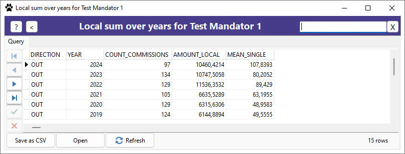

[General info](README.md) | [Database window](HELP_DatabaseWindow.md) | [Mandator window](HELP_MandatorWindow.md) | [Artist/Client window](HELP_ArtistClientWindow.md) | [Commission window](HELP_CommissionWindow.md) | Statistics

# Statistics

There are various statistics that are made available with plugins which are located in the directory
**C:\Program Files...\Commission Database 2.0\bin** and have the file name extension "SPL" (Statistics Plugin).

Note that "statistics" can be "anything" - the plugin author can freely design which information to show
and what happens when you double click an entry.
So, for example, a plugin can also be used to perform actions such as comparing the UPLOAD table
with a website/gallery and listing the difference.

In the database grid of a statistics window you can double click to list more information and/or to jump to the referenced artists, commissions, etc. Note that deleting from a statistic grid deletes the data in the base table, so be extra careful!

## BasicStatsPlugin.spl

Currently, there are the following statistics available:

- Running commissions
- Local sum over years
- Local sum over months
- Things I am waiting for (Art, Payment, Upload)
- Things I need to do (Art, Payment, Upload)
- Top artists/clients

## FolderCheckPlugin.spl

Currently, there are the following statistics available:

- Commissions without folders
- Commission folders not existing
- Comparison File System folders / Database folders (this plugin is helpful if you organize all your commissions in a single folder on your drive. Each subfolder should represent one specific commission, ensuring that your folders align exactly with your commission records)

## UploadComparisonPlugin.spl

This plugin is currently not available for the public, because it requires an undisclosed API to FA.

- Uploads found online, but not in CMDB
- Uploads found at CMDB, but not online
