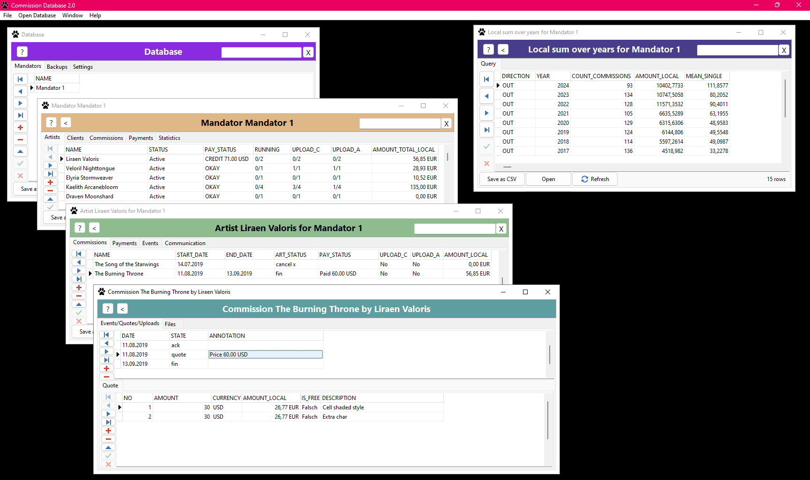

General info | [Database window](HELP_DatabaseWindow.md) | [Mandator window](HELP_MandatorWindow.md) | [Artist/Client window](HELP_ArtistClientWindow.md) | [Commission window](HELP_CommissionWindow.md) | [Statistics](HELP_Statistics.md)

# Commission Database 2.0

## What is Commission Database 2.0?

Commission Database 2.0 (CMDB2) is a management software for artists and their patrons (clients/commissioners).

It manages:
- Overview of your artists (or clients) and the open art projects
- Upload status to art pages
- Which artworks are paid for, or if you have credits or debts
- Overview of all incoming/outgoing payments, which can be useful to verify bank statements
- Various statistics such as the month/year sums of incoming/outgoing payments
- Built-in currency converter to convert foreign currencies into your local currency (as a base for the statistics)
- Shortcut to folders that contain the artworks
- Collecting various information about commissions and artists, e.g. the contact details
- Possibility to extend with plugins
- Password protection

Developers can extend the program using the programming language Embarcadero Delphi; the source files are on GitHub.

## License

The software is free; also for commercial usage. It is licensed under the terms of the Apache 2.0 license.

## Installation

CMDB2 software is only available for Microsoft Windows.

The latest version can be downloaded at [GitHub](https://github.com/danielmarschall/cmdb2/releases).

## General information

### Handling database grids

It is important to understand how to handle a database grid. Here are some notes:
- When you edit or insert a row, leaving the row (e.g. pressing the arrow down key followed by the arrow up key) or clicking the "green check" icon in the navigator will trigger the save command to the database. Closing the program might NOT always trigger the save command.
- Double clicking on a row opens the dataset.
- Nearly every window in CMDB2 is a database grid.
- Single clicking the column header will let you sort the dataset. Clicking it again will reverse the sort.
- Navigate using arrow keys, "PgUp", "PgDown", "Home", and "End" or with the arrows in the navigator bar at the left.
- When you change something in a different window and then return to a previous window, then you might reload the dataset by clicking "Refresh" at the bottom. For example, if you entered a payment for an artist, the "payment status" in the artist overview will be refreshed only after clicking the "Refresh" button.
- A small icon left on the selected row in a grid will show the current operation. An arrow means you are in "browsing" mode. A star means you are in the "insert" mode. A bar means you are in "edit" mode.
- Remove a row with "Ctrl + Del" or by clicking the "red minus" in the navigator.
- Insert a row by going past the last line using the arrow keys, or click the "blue plus" in the navigator, or press the "Insert" key.
- Cancel an edit/insert operation by pressing "Esc". Note that if you are not in the edit/insert mode, then "Esc" will close the window.
- Some fields are "boolean" which means that they only accept a yes or a no. In this case, you have to type "True" (for yes) or "False" (for no). Depending on your system locale, the names might be different, such as "Wahr" and "Falsch" for German systems.

### Common error messages

Although CMDB2 is translated into English, the development environment was German, so, unfortunately, some common error messages might be written in German. They are explained here:
- "Die zum Aktualisieren angegebene Zeile wurde nicht gefunden. Einige Werte wurden seit dem letzten Lesen ggf. geändert.": This means that you are trying to change something that was already changed somewhere else. The solution is to cancel the edit/insert operation, and refresh the dataset (or close the window and reopen it) to get a fresh dataset that can be edited.
- "In diese Spalte kann kein NULL Wert eingefügt werden": This means that you are trying to save a dataset but there are some mandatory fields missing. Check if you have entered everything that is required.

### Data storage

Where is my data stored? By default, data is stored in your Windows profile at `C:\Users\YourName\`

The data files are named:
- `cmdb2.mdf`
- `cmdb2.ldf`

### Backups

Backups are either stored in your Windows profile or the path you specified in the configuration setting `BACKUP_PATH`.

The backup files include:

- `cmdb2_backup_*.zip` which contains:

	* `cmdb2_backup_*.bak` which is the actual file that can be restored
	* `cmdb2_backup_*.csv` which is a protocol in text form that can be compared with diff-tools.

Everytime you exit CMDB2, the program will check if you have made changes somewhere in the database, and if you did so, it creates a backup of the database and giving it a sequential number.

To restore a backup, first unzip the ZIP file (it might be protected with your database password if you have set one). Then restore the BAK file using the restore command in the main menu. Alternatively, experts can restore a backup using Microsoft SQL Server Management Studio (connect to `(localdb)\MSSQLLocalDB` and restore the BAK file as database `cmdb2`.)

Backup files can be regularly purged by simply deleting the files.

### How payment work

CMDB2 works with the "down payment" system. This allows partial payments or payments for multiple commissions at once.
- In the commission window you create a "quote" event and enter the price of the commission
- In the artist/client window you enter a payment. It is recommended to add the co

The program automatically calculates how much debt or credit an artist/client has:
- Sum of all payments - Sum of all commission quotes > 0 means there is a credit
- Sum of all payments - Sum of all commission quotes < 0 means there is a debt
- Sum of all payments - Sum of all commission quotes = 0 means everything has been paid for.

### How refunding works

- In the commission window, create or enter a "quote" event and add a negative price, so that the original price is balanced to zero. (Or to a value that was agreed with the artist/client). DO NOT create a new commission with a negative price.
- If the client has already paid, then the program will recognize a Credit (Payments - Quotes > 0).
- After the client has been paid back, the negative payment will be added in the artist/client window.
- Alternatively, if the artist is paid back with another artwork, then simply add new commissions with quotes. The program will automatically keep track of the credit by subtracting the sum of quotes for the commissions from the sum of payments from.

## Explanation of all windows and tabs

### Overview

- [Database](HELP_DatabaseWindow.md)
	- [Mandator](HELP_MandatorWindow.md)
		- [Artists / Clients](HELP_ArtistClientWindow.md)
			- [Commission](HELP_CommissionWindow.md)
				- Events
					- Quote
					- Upload
				- Files
			- Payment
			- Events
			- Communication
		- Commissions (overview)
		- Payments (overview)
		- [Statistics](HELP_Statistics.md)
	- Text Dumps (Backup Protocols)
	- Settings
